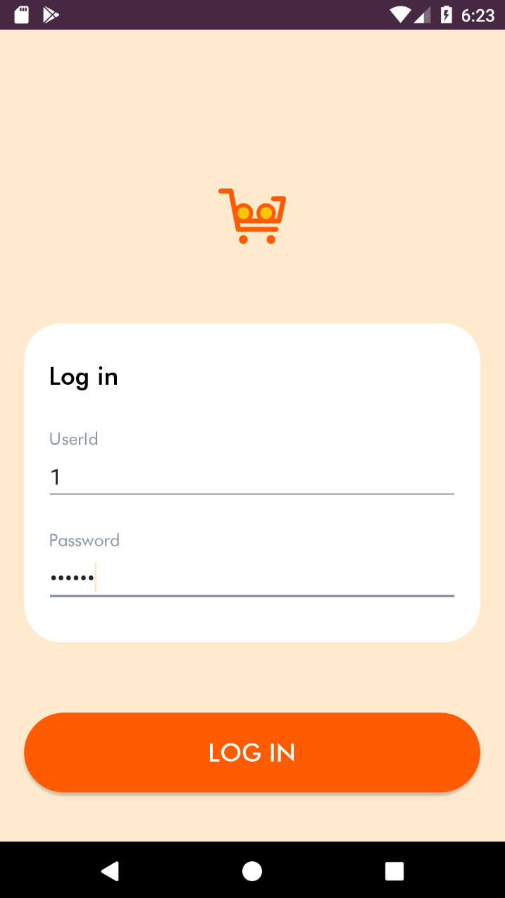
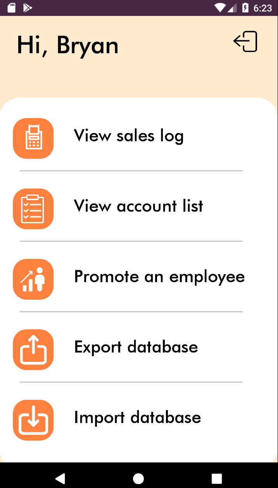
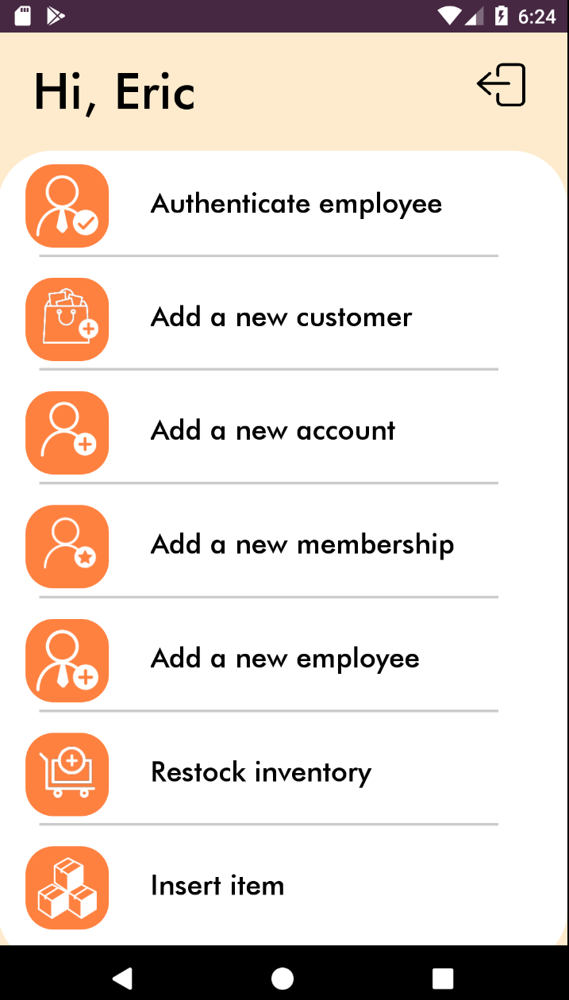

# Sales Application Clone

A group project for _CSCB07: Software Design_

Instructor: Professor Joe Bettridge

The app was a cumulative project designed to demonstrate an understanding of:
- SOLID Principles
- Android Development
- Software Design Patterns
- SDLC

and much more in an Agile environment.

## Demo
            Checking out                        Making a new customer                    Making a return

  

## Screencaps

  

## Development Details

Sprints were 1 week in length, with triweekly standups taking place every Monday, Wednesday and Friday from November 17 2019 - December 2 2019

We organized our work using a scrum board created in [Trello](https://trello.com/b/Y1srsIHc/salesapplication)

__Scrum Master:__ [Bryan Liu](https://github.com/liubryann)

## UML and Use Case Diagrams

## Running the application
1. Download `/SalesApplication` from the repository
2. Import the Project into Android Studio
3. Run on your emulator of choice (optimized for Nexus 2)

